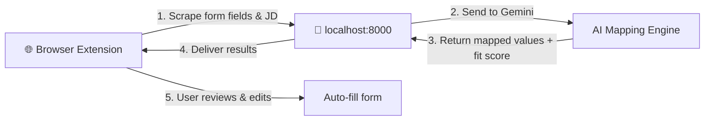

<p align="center">
  <h1 align="center">AutoApply</h1>
  <p align="center"><strong>AI-powered job application autofill — stop filling the same forms over and over.</strong></p>
</p>

<p align="center">
  
  
  
  
  
</p>

<p align="center">
  Upload your resume once. Let Gemini handle every field, every question, every form — across Workday, Greenhouse, Lever, and more.
</p>

---

## Features

| Feature | Description |
|---|---|
| **AutoPilot mode** | Fills multi-page applications end-to-end — scrapes, fills, clicks Next, repeats, and stops at the submit page for your review |
| **One API call per page** | Gemini maps *all* form fields in a single request — fast and cost-efficient |
| **Resume parsing** | Upload your PDF once; Gemini extracts and structures everything automatically |
| **Cover letter generator** | One-click cover letters that sound human — bans corporate clichés like "passionate" and "thrilled" |
| **Job fit analysis** | Match score with skill breakdowns before you apply |
| **Resume tailoring** | AI-generated resume tweaks customized to each job description |
| **Application dashboard** | Web UI at `/dashboard` with stats, search, filtering, and inline status editing |
| **CSV export** | Download your full application history as a spreadsheet |
| **Answer memory** | Saves your open-ended answers and reuses context for similar future questions |
| **Batch apply** | Paste multiple job URLs and run AutoPilot across tabs sequentially |
| **17 ATS platforms** | Workday · Greenhouse · Lever · Ashby · iCIMS · SmartRecruiters · Taleo · BambooHR · LinkedIn · Indeed · Glassdoor · Wellfound · Darwinbox · Oracle · Naukri · Instahyre · Keka |
| **Firefox + Chrome** | Full support for both browsers (Manifest V2 and V3) |
| **Shadow DOM isolation** | Extension UI never conflicts with page styles — works on any site |
| **Learns from corrections** | Edit a value once and AutoApply remembers for next time |
| **Desktop notifications** | Get notified when applications are logged |
| **Keyboard shortcut** | `Ctrl+Shift+A` to activate instantly |

---

## How It Works



**The flow:**

1. You land on a job application page and press `Ctrl+Shift+A`
2. The extension scrapes every form field and the job description
3. Your local FastAPI backend sends it all to Gemini in one call
4. Gemini returns intelligent values mapped from your resume + knowledge
5. You review everything in a glassmorphic overlay, tweak if needed
6. Click **Fill & Advance**, **Fill Only**, or **AutoPilot** to let it handle the whole application

> **Privacy first:** Your data never leaves your machine except for the Gemini API call. No telemetry, no cloud storage, no accounts.

---

## Quick Start

### 1. Clone & Set Up the Backend

```bash
git clone https://github.com/geckguy/AutoApply.git
cd AutoApply

# One-command setup (creates venv, installs deps, sets up .env)
./setup.sh
# Then edit backend/.env and paste your Gemini API key (see section below)
```

<details>
<summary>Manual setup (if you prefer)</summary>

```bash
python3 -m venv backend/venv
source backend/venv/bin/activate
pip install -r backend/requirements.txt
cp backend/.env.example backend/.env
# Edit backend/.env and paste your Gemini API key
```

</details>

### 2. Start the Server

```bash
source backend/venv/bin/activate
python -m backend.main
```

You should see:

```
INFO:     Uvicorn running on http://127.0.0.1:8000
```

Verify at [http://127.0.0.1:8000/api/health](http://127.0.0.1:8000/api/health).

### 3. Install the Browser Extension

#### Firefox

1. Open Firefox → type `about:debugging#/runtime/this-firefox` in the address bar
2. Click **"Load Temporary Add-on…"**
3. Navigate to `extension/` and select **`manifest.json`**
4. The AutoApply icon appears in your toolbar

#### Chrome / Edge / Brave

1. Go to `chrome://extensions/` (or `edge://extensions/`)
2. Enable **Developer mode** (toggle in the top-right)
3. Click **"Load unpacked"**
4. Select the **`extension-chrome/`** folder

> **Tip:** Navigate to any job application page, click the icon (or press `Ctrl+Shift+A`), and watch it work.

---

## Getting a Gemini API Key

1. Go to **[Google AI Studio](https://aistudio.google.com/apikey)**
2. Click **"Create API Key"**
3. Copy the key
4. Paste it into `backend/.env`:
   ```env
   GEMINI_API_KEY=your_api_key_here
   ```

> AutoApply uses Gemini 2.5 Flash which is free for personal use via Google AI Studio.

---

## Usage Guide

### First-Time Setup

1. **Click the AutoApply icon** in your browser toolbar
2. Confirm the status shows **Backend Active** (green dot)
3. Go to the **Profile & Info** tab
4. **Upload your resume** (PDF) — Gemini parses and structures it automatically
5. **Add knowledge notes** — anything not on your resume:
   - Salary expectations
   - Visa / work authorization status
   - Notice period & availability
   - Remote / hybrid / on-site preferences
   - Any other details you find yourself typing repeatedly

### Filling Applications

1. **Navigate** to any job application page (Workday, Greenhouse, Lever, etc.)
2. **Activate** — click the toolbar icon or press `Ctrl+Shift+A`
3. **Review** the overlay panel:
   - **Fit Score** — how well you match, with skill breakdowns
   - **Duplicate Alert** — warns if you've applied to this role before
   - **Field List** — every detected field with the AI-suggested value
   - **Confidence Colors** — 🟢 High · 🟡 Medium · 🔴 Low/Generated · ⚪ Skip
4. **Edit** any value by clicking the ✎ icon
5. Choose your action:
   - **Fill Only** — fills values without navigating
   - **Fill & Next** — fills and clicks the Next/Continue button
   - **AutoPilot** — fills this page and every following page automatically, stopping at the submit page for manual review

> Every correction you make is saved. AutoApply learns your preferences and gets smarter over time.

### AutoPilot

AutoPilot handles multi-page applications end-to-end. It detects the final page by looking for submit buttons, progress indicators ("Step 5 of 5"), and input field counts. It will **never click Submit** — it always stops for your manual review.

### Cover Letters

When AutoApply detects a "cover letter" textarea, a **✍ Generate Cover Letter** button appears. One click generates a personalized letter using your resume and the job description — written to sound natural, not like AI.

### Dashboard

Visit [http://127.0.0.1:8000/dashboard](http://127.0.0.1:8000/dashboard) to see your full application history. The dashboard includes:
- Stats: total applications, weekly count, interviews, offers, average fit score
- Search and filter by company, role, platform, status, and date range
- Inline status editing (applied → interview → offer, etc.)
- CSV export for spreadsheets

### Batch Apply

In the extension popup, switch to the **Batch** tab, paste multiple job application URLs (one per line), and click **Start Batch Apply**. AutoApply opens each in a new tab and runs AutoPilot sequentially.

---

## Project Structure

```
AutoApply/
├── backend/
│   ├── main.py                  # FastAPI entry point + CORS + lifespan
│   ├── services/
│   │   ├── gemini.py            # Gemini API client + rate limiter
│   │   ├── field_mapper.py      # AI-powered form field mapping
│   │   ├── answer_generator.py  # Custom question answer generation
│   │   ├── job_analyzer.py      # Job fit scoring engine
│   │   ├── resume_parser.py     # PDF resume parsing (pdfplumber + Gemini)
│   │   ├── cover_letter.py      # Cover letter generation
│   │   ├── resume_tailor.py     # Job-specific resume tailoring
│   │   └── database.py          # SQLite data layer
│   ├── routers/
│   │   ├── autofill.py          # /api/autofill, cover-letter, tailor-resume
│   │   ├── profile.py           # /api/profile + resume upload
│   │   └── applications.py      # /api/applications + CSV export
│   ├── dashboard/               # Web dashboard UI (HTML/CSS/JS)
│   ├── models/                  # Pydantic data models
│   ├── data/                    # SQLite DB + user data (auto-created)
│   ├── .env.example             # Environment template
│   └── requirements.txt         # Python dependencies
├── extension/                   # Firefox extension (Manifest V2)
│   ├── manifest.json
│   ├── content/                 # Content scripts (scraper, filler, overlay)
│   ├── popup/                   # Toolbar popup (profile, status, batch)
│   ├── background/              # Background script
│   └── lib/                     # Shared utilities + browser polyfill
├── extension-chrome/            # Chrome/Edge extension (Manifest V3)
│   ├── manifest.json
│   └── ...                      # Same codebase with MV3 shims
├── setup.sh                     # One-command setup
└── README.md
```

---

## API Endpoints

| Endpoint | Method | Description |
|---|---|---|
| `/api/health` | GET | Health check |
| `/api/autofill` | POST | Generate fill instructions for form fields |
| `/api/analyze-job` | POST | Job fit analysis with match scoring |
| `/api/corrections` | POST | Log user corrections for learning |
| `/api/cover-letter` | POST | Generate a personalized cover letter |
| `/api/tailor-resume` | POST | Get job-specific resume suggestions |
| `/api/profile/upload-resume` | POST | Upload and parse PDF resume |
| `/api/profile/upload-knowledge` | POST | Save knowledge/notes file |
| `/api/profile/` | GET/PUT | Get or update profile |
| `/api/applications/` | GET/POST | List or log applications |
| `/api/applications/export` | GET | Download CSV export |
| `/api/applications/check-duplicate` | GET | Check for duplicate applications |
| `/api/applications/{id}/status` | PUT | Update application status |
| `/dashboard` | GET | Web dashboard UI |

---

## Configuration

### Environment Variables

| Variable | Required | Default | Description |
|---|---|---|---|
| `GEMINI_API_KEY` | Yes | — | Your Google Gemini API key ([get one free](https://aistudio.google.com/apikey)) |

### Extension Settings

All configuration is done through the extension popup — no config files needed:

- **Resume** — upload via the Profile & Info tab
- **Knowledge file** — free-text notes for details not on your resume
- **Backend URL** — defaults to `http://127.0.0.1:8000`

---

## Privacy & Security

AutoApply is designed to keep your data private:

- **100% local** — the backend runs on your machine (`localhost:8000`), your resume and profile data are stored in a local `backend/data/` directory
- **No accounts** — no signup, no login, no cloud services
- **No telemetry** — zero tracking, zero analytics, zero data collection
- **Gemini API only** — the only external call is to Google's Gemini API for AI processing. Your data is sent directly from your machine to Google's API and is subject to [Google's API terms](https://ai.google.dev/terms)
- **Open source** — every line of code is auditable

---

## Tech Stack

| Layer | Technology |
|---|---|
| **Backend** | Python 3.11+ · FastAPI · Uvicorn · SQLite |
| **AI** | Google Gemini 2.5 Flash · pdfplumber |
| **Extension** | Firefox (Manifest V2) · Chrome/Edge (Manifest V3) · Vanilla JS · Shadow DOM |
| **Styling** | Pure CSS · Glassmorphism · CSS animations |

> **Zero build complexity:** No frameworks, no build step, no npm, no webpack — just clone and run.

---

## Contributing

Contributions are welcome! Here's how to get started:

1. **Fork** the repository
2. **Create a branch** for your feature or fix:
   ```bash
   git checkout -b feat/your-feature-name
   ```
3. **Make your changes** and test thoroughly
4. **Commit** with a descriptive message
5. **Push** and open a **Pull Request**

### Areas where help is appreciated

- Adding support for more ATS platforms
- Test coverage for backend services
- UI/UX improvements to the overlay and popup
- Documentation and examples
- Bug reports with reproduction steps

---

## License

This project is licensed under the **MIT License** — see the [LICENSE](LICENSE) file for details.

---

<p align="center">
  <strong>Built with ❤️ and way too many job applications.</strong><br>
  <sub>If AutoApply saved you time, consider giving it a ⭐</sub>
</p>
