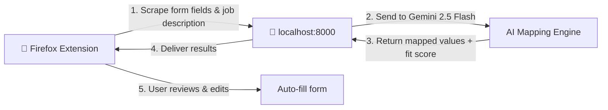

<p align="center">
  <h1 align="center">AutoApply</h1>
  <p align="center"><strong>AI-powered job application autofill - stop filling the same forms over and over.</strong></p>
</p>

<p align="center">
  
  
  
  
</p>

<p align="center">
  Upload your resume once. Let Gemini handle every field, every question, every form - across Workday, Greenhouse, Lever, and more.
</p>

---

## Features

| Feature | Description |
|---|---|
| **One API call per page** | Gemini maps *all* form fields in a single request - fast and cost-efficient |
| **Resume parsing** | Upload your PDF once; AutoApply extracts and structures everything automatically |
| **Job fit analysis** | Get a match score with skill breakdowns before you apply |
| **Application tracking** | Full history of every application, stored locally in SQLite |
| **10+ ATS platforms** | Workday - Greenhouse - Lever - Ashby - LinkedIn - Indeed - Glassdoor - Naukri - Instahyre - Keka - and more |
| **Shadow DOM isolation** | Extension UI never conflicts with page styles - works on any site |
| **Keyboard shortcut** | `Ctrl+Shift+A` to activate instantly |
| **Draggable overlay** | Expand, collapse, and reposition the review panel however you like |
| **Learns from corrections** | Edit a value once and AutoApply remembers for next time |
| **Custom answer generation** | AI-generated responses to open-ended and screening questions |

---

## How It Works



**The flow in plain English:**

1. You land on a job application page and press `Ctrl+Shift+A`
2. The extension scrapes every form field and the job description
3. Your local FastAPI backend sends it all to Gemini in one call
4. Gemini returns intelligent values mapped from your resume + knowledge
5. You review everything in a glassmorphic overlay, tweak if needed
6. Click **Fill & Advance** - fields are filled and the page advances

> **Privacy first:** Your data never leaves your machine except for the Gemini API call. No telemetry, no cloud storage, no accounts.

---

## Quick Start

### 1. Clone & Set Up the Backend

```bash
git clone https://github.com/YOUR_USERNAME/AutoApply.git
cd AutoApply

# One-command setup (creates venv, installs deps, sets up .env)
./setup.sh
# Then edit backend/.env and paste your Gemini API key (see section below)
```

<details>
<summary>Manual setup (if you prefer)</summary>

```bash
python3 -m venv backend/venv
source backend/venv/bin/activate
pip install -r backend/requirements.txt
cp backend/.env.example backend/.env
# Edit backend/.env and paste your Gemini API key
```

</details>

### 2. Start the Server

```bash
source backend/venv/bin/activate
python -m backend.main
```

You should see:

```
INFO:     Uvicorn running on http://127.0.0.1:8000
```

Verify at [http://127.0.0.1:8000/api/health](http://127.0.0.1:8000/api/health).

### 3. Install the Firefox Extension

1. Open Firefox → type `about:debugging#/runtime/this-firefox` in the address bar
2. Click **"Load Temporary Add-on…"**
3. Navigate to `extension/` and select **`manifest.json`**
4. The AutoApply icon appears in your toolbar - you're ready!

> **Tip:** Navigate to any job application page, click the icon (or press `Ctrl+Shift+A`), and watch it work.

---

## Getting a Gemini API Key

1. Go to **[Google AI Studio](https://aistudio.google.com/apikey)**
2. Click **"Create API Key"**
3. Copy the key
4. Paste it into `backend/.env`:
   ```env
   GEMINI_API_KEY=your_api_key_here
   ```

> **Note:** AutoApply uses Gemini 2.5 Flash by default because it is completely free for personal use via Google AI Studio. You get excellent performance without paying per API call.

---

## Usage Guide

### First-Time Setup

1. **Click the AutoApply icon** in your Firefox toolbar
2. Confirm the status shows **Backend Active** (pulsing green dot)
3. Go to the **Profile & Info** tab
4. **Upload your resume** (PDF) - drag & drop or click to browse. Gemini parses and structures it automatically.
5. **Add knowledge notes** - anything not on your resume:
   - Salary expectations
   - Visa / work authorization status
   - Notice period & availability
   - Remote / hybrid / on-site preferences
   - Any other details you find yourself typing repeatedly

### Filling Applications

1. **Navigate** to any job application page (Workday, Greenhouse, Lever, etc.)
2. **Activate** - click the toolbar icon or press `Ctrl+Shift+A`
3. **Review** the overlay panel:
   - **Fit Score** - how well you match, with skill breakdowns
   - **Duplicate Alert** - warns if you've applied to this role/company before
   - **Field List** - every detected field with the AI-suggested value
   - **Confidence Colors** - High · Medium · Low/Generated · Skip
4. **Edit** any value by clicking the ✎ icon → update → press ✓ or Enter
5. **Fill & Advance ➔** - writes all values and clicks the Next/Continue button
6. **Fill Only** - on the final page, fills values without advancing
7. **Submit manually** - AutoApply *never* clicks Submit for you

> **Pro tip:** Every correction you make is saved. AutoApply learns your preferences and gets smarter over time.

---

## Project Structure

```
AutoApply/
├── backend/
│   ├── main.py                  # FastAPI entry point + CORS + lifespan
│   ├── services/
│   │   ├── gemini.py            # Gemini API client + rate limiter
│   │   ├── field_mapper.py      # AI-powered form field mapping
│   │   ├── answer_generator.py  # Custom question answer generation
│   │   ├── job_analyzer.py      # Job fit scoring engine
│   │   ├── resume_parser.py     # PDF resume parsing (pdfplumber + Gemini)
│   │   └── database.py          # SQLite data layer
│   ├── routers/
│   │   ├── autofill.py          # /api/autofill endpoints
│   │   ├── profile.py           # /api/profile + resume upload
│   │   └── applications.py      # /api/applications tracking
│   ├── models/
│   │   ├── form_schema.py       # Form field Pydantic schemas
│   │   ├── profile.py           # Profile data models
│   │   └── application.py       # Application tracking models
│   ├── data/                    # SQLite DB + JSON storage (auto-created)
│   ├── .env.example             # Environment template
│   └── requirements.txt         # Python dependencies
├── extension/
│   ├── manifest.json            # Firefox Manifest V2 definition
│   ├── content/
│   │   ├── scraper.js           # DOM form field scraper
│   │   ├── overlay.js           # Glassmorphic review UI (Shadow DOM)
│   │   ├── overlay.css          # Overlay styles
│   │   └── filler.js            # Event-driven form filler
│   ├── popup/                   # Toolbar popup (profile, status, controls)
│   ├── background/              # Background service worker
│   ├── lib/                     # Shared utilities
│   └── icons/                   # Extension icons
└── README.md
```

---

## Configuration

### Environment Variables

| Variable | Required | Default | Description |
|---|---|---|---|
| `GEMINI_API_KEY` | Yes | - | Your Google Gemini API key ([get one free](https://aistudio.google.com/apikey)) |

### Extension Settings

All configuration is done through the extension popup - no config files needed:

- **Resume** - upload via the Profile & Info tab
- **Knowledge file** - free-text notes for details not on your resume
- **Backend URL** - defaults to `http://127.0.0.1:8000` (configurable if needed)

---

## Tech Stack

| Layer | Technology |
|---|---|
| **Backend** | Python 3.11+ · FastAPI · Uvicorn · SQLite |
| **AI** | Google Gemini 2.5 Flash · pdfplumber |
| **Extension** | Firefox WebExtension (Manifest V2) · Vanilla JS · Shadow DOM |
| **Styling** | Pure CSS · Glassmorphism · CSS animations |

> **Zero build complexity:** No frameworks, no build step, no npm, no webpack - just clone and run.

---

## Contributing

Contributions are welcome! Here's how to get started:

1. **Fork** the repository
2. **Create a branch** for your feature or fix:
   ```bash
   git checkout -b feat/your-feature-name
   ```
3. **Make your changes** and test thoroughly
4. **Commit** with a descriptive message:
   ```bash
   git commit -m "feat: add support for new ATS platform"
   ```
5. **Push** and open a **Pull Request**

### Areas where help is appreciated

- Adding support for more ATS platforms
- Test coverage for backend services
- UI/UX improvements to the overlay and popup
- Documentation and examples
- Bug reports with reproduction steps

---

## License

This project is licensed under the **MIT License** - see the [LICENSE](LICENSE) file for details.

---

<p align="center">
  <strong>Built with ❤️ and way too many job applications.</strong><br>
  <sub>If AutoApply saved you time, consider giving it a ⭐</sub>
</p>
