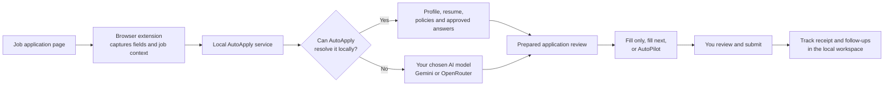

<p align="center">
  
</p>

<h1 align="center">AutoApply</h1>

<p align="center">
  <strong>Prepare faster. Review everything. Submit yourself.</strong>
</p>

<p align="center">
  A local-first job application assistant for Firefox, Chrome, Edge, and Brave.
</p>

<p align="center">
  <a href="https://www.python.org/"></a>
  <a href="https://fastapi.tiangolo.com/"></a>
  <a href="https://www.mozilla.org/firefox/"></a>
  <a href="https://www.google.com/chrome/"></a>
  <a href="https://www.microsoft.com/edge"></a>
  <a href="https://brave.com/"></a>
</p>

<p align="center">
  <a href="https://ai.google.dev/gemini-api"></a>
  <a href="https://openrouter.ai/"></a>
  <a href="LICENSE"></a>
</p>

AutoApply combines a browser extension with a local Python service. It reads application forms, resolves known details from your profile and resume, uses your chosen AI model only when needed, and lets you review the result before anything is submitted.

> AutoApply never clicks the final **Submit** button. You stay in control of every application.

## Why AutoApply

| | |
|---|---|
| **Local-first** | Your profile, resumes, application history, and workspace stay on your computer. |
| **Review-first** | Inspect and edit every prepared field before filling the page. |
| **Model-flexible** | Use Gemini directly or select any model available through OpenRouter. |
| **Cross-browser** | Install on Firefox or Chromium browsers including Chrome, Edge, and Brave. |

## Features

- Reuses profile details, resume data, policies, approved answers, and learned corrections
- Prepares application fields with confidence and review states
- Handles multi-page forms with AutoPilot and stops before submission
- Builds a persistent review queue from multiple job URLs
- Generates tailored answers, cover letters, fit analysis, and resume versions
- Tracks applications, follow-ups, interviews, contacts, and submission receipts
- Supports light, dark, and system themes across the dashboard and extension
- Works with major ATS platforms and falls back to generic form detection

## How it works


```mermaid
flowchart LR
    A["Job application page"] --> B["Browser extension<br/>captures fields and job context"]
    B --> C["Local AutoApply service"]
    C --> D{"Can AutoApply<br/>resolve it locally?"}
    D -->|"Yes"| E["Profile, resume,<br/>policies and approved answers"]
    D -->|"No"| F["Your chosen AI model<br/>Gemini or OpenRouter"]
    E --> G["Prepared application review"]
    F --> G
    G --> H["Fill only, fill next,<br/>or AutoPilot"]
    H --> I["You review and submit"]
    I --> J["Track receipt and follow-ups<br/>in the local workspace"]
```

Known details stay on the local path. Only unresolved fields are sent to the AI provider you configure, and every route ends with your review before submission.

## AI model support

AutoApply provides three provider integrations:

- **Google Gemini** — direct integration using Gemini 2.5 Flash
- **OpenRouter** — set `OPENROUTER_MODEL` to any model available to your OpenRouter account
- **OpenCode Go** — an OpenAI-compatible subscription gateway that serves many open models (DeepSeek, Kimi, GLM, Qwen, MiniMax …) behind one key; set `AI_PROVIDER=opencode`, `OPENCODE_API_KEY` and `OPENCODE_MODEL` (for example `deepseek-v4.1-flash`). Run `curl -H "Authorization: Bearer $OPENCODE_API_KEY" https://opencode.ai/zen/go/v1/models` to list the ids your subscription can use.

This gives you access to a broad choice of models without tying AutoApply to one AI vendor. Any other OpenAI-compatible gateway works through the same client — point `OPENCODE_BASE_URL` at it and set `OPENCODE_API_KEY`/`OPENCODE_MODEL` accordingly.

## Quick start

### 1. Set up the local service

```bash
git clone https://github.com/geckguy/AutoApply.git
cd AutoApply
./setup.sh
```

Configure one provider in `backend/.env`:

```env
# Gemini
AI_PROVIDER=gemini
GEMINI_API_KEY=your_key_here
```

or:

```env
# Any model available through OpenRouter.
# OPENROUTER_MODEL is required. With no model set, every AI-backed request
# answers 503 and the extension falls back to local answers only.
AI_PROVIDER=openrouter
OPENROUTER_API_KEY=your_key_here
OPENROUTER_MODEL=provider/model-name
OPENROUTER_PRIVACY_MODE=strict
```

Start AutoApply:

```bash
source backend/venv/bin/activate
python -m backend.main
```

Open the workspace at [http://127.0.0.1:8000/dashboard](http://127.0.0.1:8000/dashboard).

The service listens on loopback port 8000 by default. Set `AUTOAPPLY_HOST` / `AUTOAPPLY_PORT`
in `backend/.env` to change that; the dashboard works on any port, but the extension has to be
told, so set the **Backend** field in the popup to the same address (for example
`http://127.0.0.1:8123`) and press **Save**.

### 2. Load the extension

#### Firefox

1. Open `about:debugging#/runtime/this-firefox`.
2. Choose **Load Temporary Add-on**.
3. Select `extension/manifest.json`.

#### Chrome, Edge, or Brave

1. Open the browser's extensions page and enable **Developer mode**.
2. Choose **Load unpacked**.
3. Select the `extension-chrome/` folder.

## How to use it

1. Add your profile, resume, and reusable details in the workspace.
2. Visit a job application page.
3. Click the extension or press `Ctrl+Shift+A`.
4. Review the prepared fields.
5. Choose **Fill Only**, **Fill & Next**, or **AutoPilot**.
6. Review the completed application and submit it yourself.

AutoApply includes tailored handling for common platforms such as Workday, Greenhouse, Lever, Ashby, iCIMS, SmartRecruiters, Taleo, and Oracle. Generic form detection supports many other application sites.

## Privacy and safety

- The service and application database run locally.
- The API listens on loopback only, and rejects any API request whose `Host` header is not
  `localhost`, `127.0.0.1`, or `[::1]`. That check is what stops a public page from using
  DNS rebinding to reach the local service.
- Browser requests are accepted from a loopback origin or from a pinned AutoApply extension
  id (`autoapply@local`, or the published Chrome id). Requests with no `Origin` header —
  local command-line tools and scripts — are accepted, because the `Host` check above is
  what keeps other machines out.
- There are no AutoApply accounts, analytics, or telemetry.
- Only unresolved fields are sent to your configured AI provider.
- Sensitive authentication, payment, and government-ID fields are excluded.
- AutoPilot advances through safe form steps but never submits an application.

Review your chosen model provider's privacy terms before sending resume or profile information. OpenRouter strict mode requests providers that deny data collection and support zero data retention.

`AUTOAPPLY_ALLOWED_HOSTS` and `AUTOAPPLY_EXTENSION_IDS` in `backend/.env` add extra hostnames
or extension ids to the defaults, for example a reverse-proxy hostname or a locally built
extension. Leave them empty unless you need them.

`backend/.env` is gitignored and no key has ever been committed, but it does live in this
directory: if you have shared, synced, or backed up the folder, rotate the provider keys
(`GEMINI_API_KEY` / `OPENROUTER_API_KEY`) and issue replacements.

## Development

Run the complete local check suite:

```bash
bash scripts/check.sh
```

It compiles the Python sources, runs the unit tests, checks every JavaScript file for syntax
errors, runs the browser-side safety tests, validates both extension manifests, and fails if
`extension-chrome/` has drifted from `extension/`.

```text
backend/             FastAPI service and dashboard
extension/           Firefox extension (canonical source for both packages)
extension-chrome/    Chrome, Edge, and Brave extension (generated)
scripts/             check.sh, sync-extension.sh
tests/               Backend and browser safety tests
```

`extension/` is the single source of truth. Chrome cannot load scripts from outside its own
extension directory, so `extension-chrome/` holds copies of the shared files plus its own
`manifest.json` and a small `browser` shim in `background/background.js`. After editing
anything under `extension/`, regenerate the Chromium tree:

```bash
bash scripts/sync-extension.sh          # rewrite extension-chrome/
bash scripts/sync-extension.sh --check  # verify without writing (check.sh runs this)
```

`backend/requirements.txt` lists the direct dependencies; `backend/requirements.lock` pins the
fully resolved set (including transitive packages) for a reproducible install.

## License

[MIT](LICENSE)

---

<p align="center">
  <strong>Built with ❤️ and way too many job applications.</strong><br>
  <sub>If AutoApply saved you time, consider giving it a ⭐</sub>
</p>
